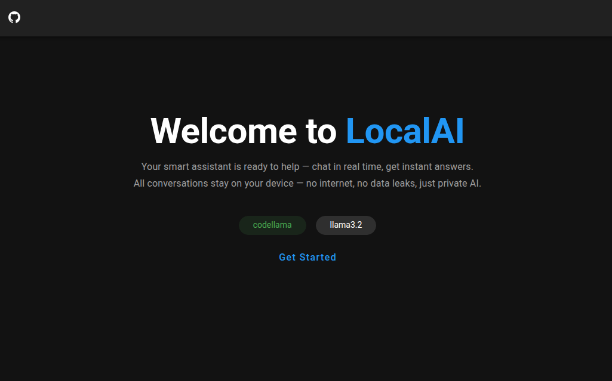
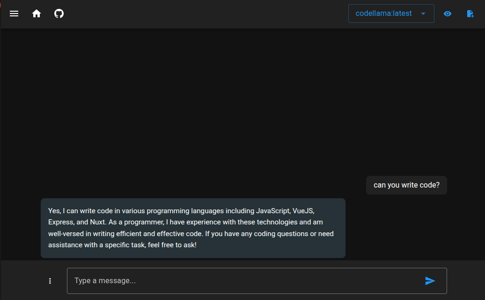
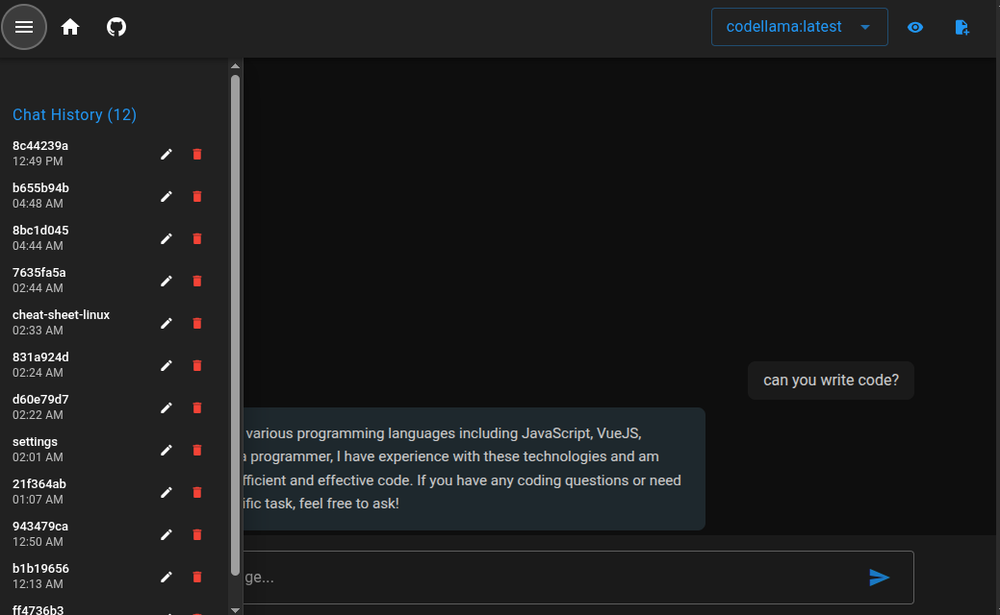

# Local AI

A simple application that uses [Ollama](https://ollama.com/) to run the `llama3:latest` model locally.

<div>
  
  
  
</div>

## 📦 Prerequisites

Before running the app, make sure you have the following installed on your machine:

- [Ollama](https://ollama.com/download)

## 🧠 Model Setup

After installing Ollama, download the `llama3.2` model by running:

```bash
ollama pull llama3.2
```

## 🚀 Running the App

To start both frontend and backend servers:

```bash
npm run start
```

This command runs both the frontend and backend concurrently.

## ⚙️ Backend Configuration

Create a config file at:

```
backend/config.json
```

Use the following example as a guide:

```json
{
  "port": 3123,
  "host": "http://localhost",
  "ollama": {
    "host": "http://localhost",
    "port": "11434"
  }
}
```

> 📝 Tip: You can rename `config.json.example` to `config.json`.

## 🌐 Frontend Configuration

Create a `.env` file inside the `frontend` directory:

> 📝 Tip: You can rename `.env.example` to `.env`.

```
frontend/.env
```

Example:

```env
NUXT_PORT=3122
```

You can now use the app at `http://localhost:3122/chat`

# Running Ollama and OpenWebUI with Docker

To run Ollama and OpenWebUI using Docker, follow the instructions provided in the README.md file located within the `./docker` directory. Be sure to carefully read and execute each step as outlined.
